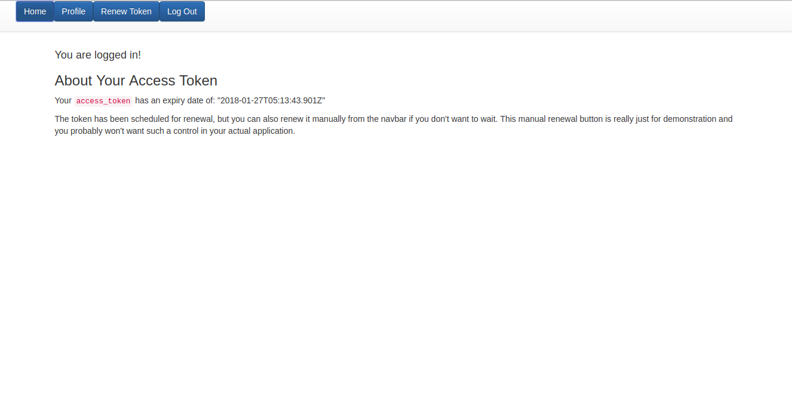

# Auth0 React App with Token Renewal
[](https://github.com/sumn2u/react-auth0-typescript/issues) [](https://github.com/sumn2u/react-auth0-typescript/network) [](https://github.com/sumn2u/react-auth0-typescript/stargazers) [](https://github.com/sumn2u/react-auth0-typescript/blob/master/LICENSE.txt) [](https://twitter.com/intent/tweet?text=Wow:&url=https%3A%2F%2Fgithub.com%2Fsumn2u%2Freact-auth0-typescript)


> React Application created by create-react-app (Typescript) which includes Auth0

This sample demonstrates how to renew `access_token`s in a React application with Auth0 using `checkSession`. For more information, read [ reference documentation](https://auth0.com/docs/libraries/auth0js#using-checksession-to-acquire-new-tokens). The sample uses the create-react-app.

## Getting Started

Create a new API in the [APIs section](https://manage.auth0.com/#/apis) and provide an identifier for it.

Clone the repo or download it from the React quickstart page in Auth0's documentation. Install create-react-app and the dependencies for the app.

```bash
npm install -g create-react-app
cd react-auth0-typescript
npm install
```

## Set the Client ID, Domain, and API URL

If you download the sample from the quickstart page, it will come pre-populated with the **client ID** and **domain** for your application. If you clone the repo directly from Github, rename the `auth0-variables.tsx.example` file to `auth0-variables.tsx` and provide the **client ID** and **domain** there. This file is located in `src/Auth/`.

## Set Up `Allowed Web Origins` in the dashboard

In order to make `checkSession` work, you need to add the URL where the authorization request originates from, to the Allowed Web Origins list of your Auth0 client in the Dashboard under your client's Settings.

## Run the Application

The development server that comes with create-react-app can be used to serve the application.

```bash
npm start
```

The application will be served at `http://localhost:3000`.

## Troubleshooting

If you see an error on renewal saying `login_required`, that means you may be using the Auth0 dev keys for whichever social login you're testing. You'll need to add your own keys for this to work.

## Run the Application With Docker

In order to run the example with docker you need to have `docker` installed.

You also need to set the environment variables as explained [previously](#set-the-client-id-domain-and-api-url).

Execute in command line `sh exec.sh` to run the Docker in Linux, or `.\exec.ps1` to run the Docker in Windows.

## What is Auth0?

Auth0 helps you to:

* Add authentication with [multiple authentication sources](https://docs.auth0.com/identityproviders), either social like **Google, Facebook, Microsoft Account, LinkedIn, GitHub, Twitter, Box, Salesforce, amont others**, or enterprise identity systems like **Windows Azure AD, Google Apps, Active Directory, ADFS or any SAML Identity Provider**.
* Add authentication through more traditional **[username/password databases](https://docs.auth0.com/mysql-connection-tutorial)**.
* Add support for **[linking different user accounts](https://docs.auth0.com/link-accounts)** with the same user.
* Support for generating signed [Json Web Tokens](https://docs.auth0.com/jwt) to call your APIs and **flow the user identity** securely.
* Analytics of how, when and where users are logging in.
* Pull data from other sources and add it to the user profile, through [JavaScript rules](https://docs.auth0.com/rules).

## Create a Free Auth0 Account

1. Go to [Auth0](https://auth0.com/signup) and click Sign Up.
2. Use Google, GitHub or Microsoft Account to login.


## Author

Suman Kunwar

## License

This project is licensed under the MIT license. See the [LICENSE](LICENSE) file for more info.
